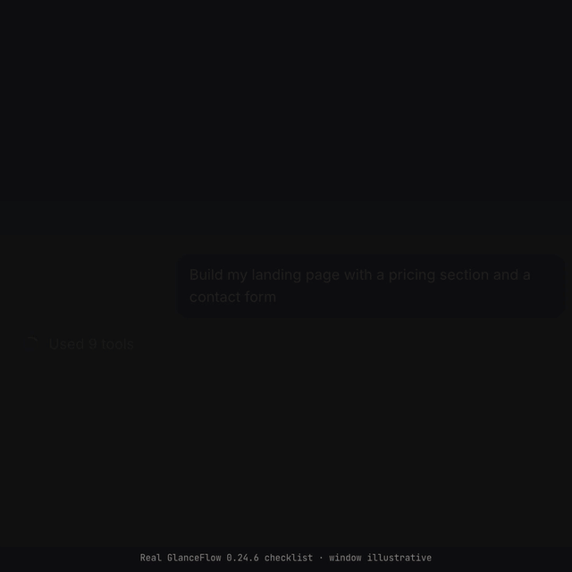
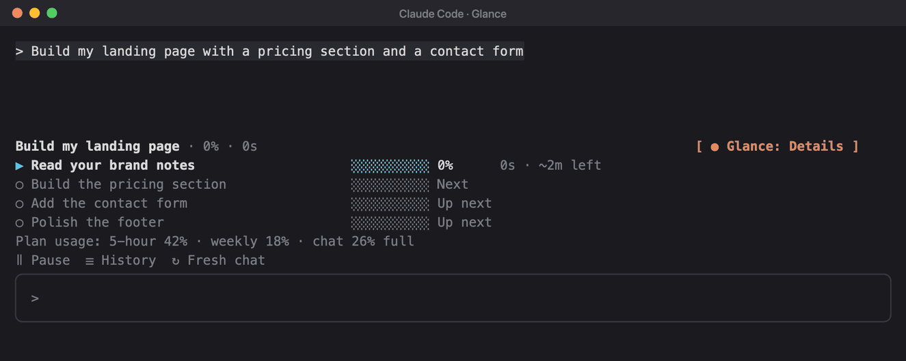
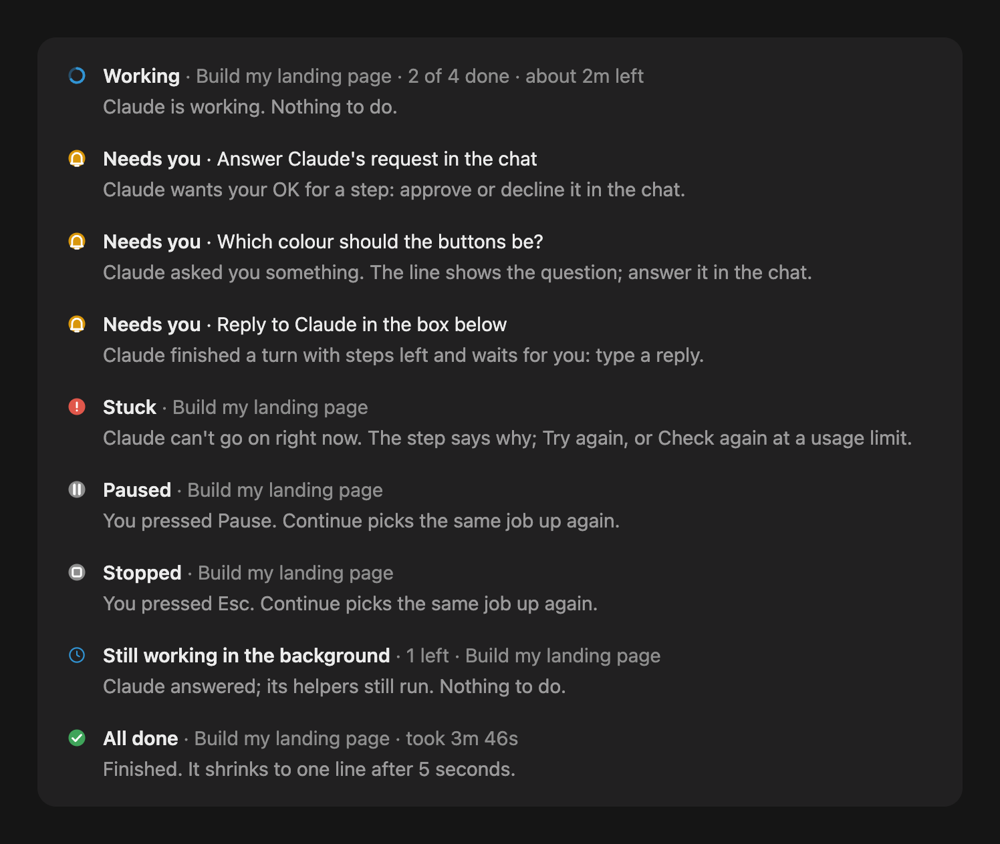
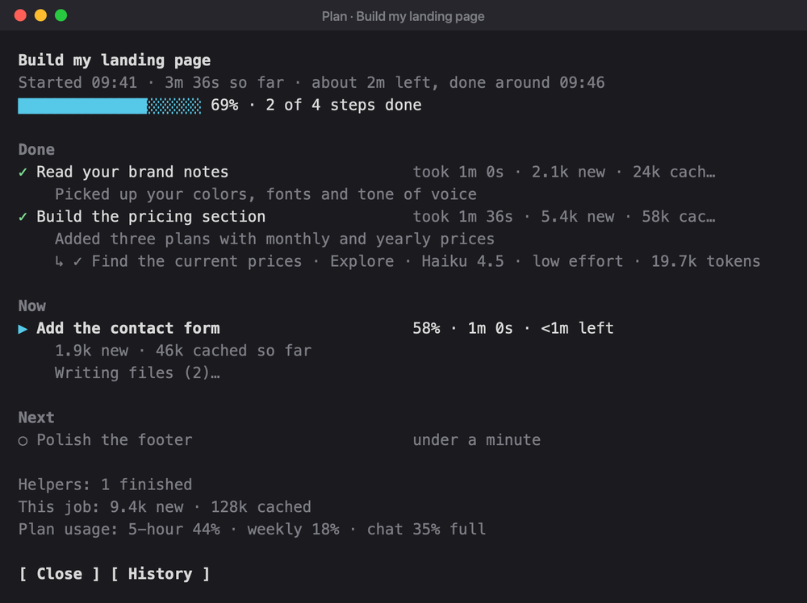
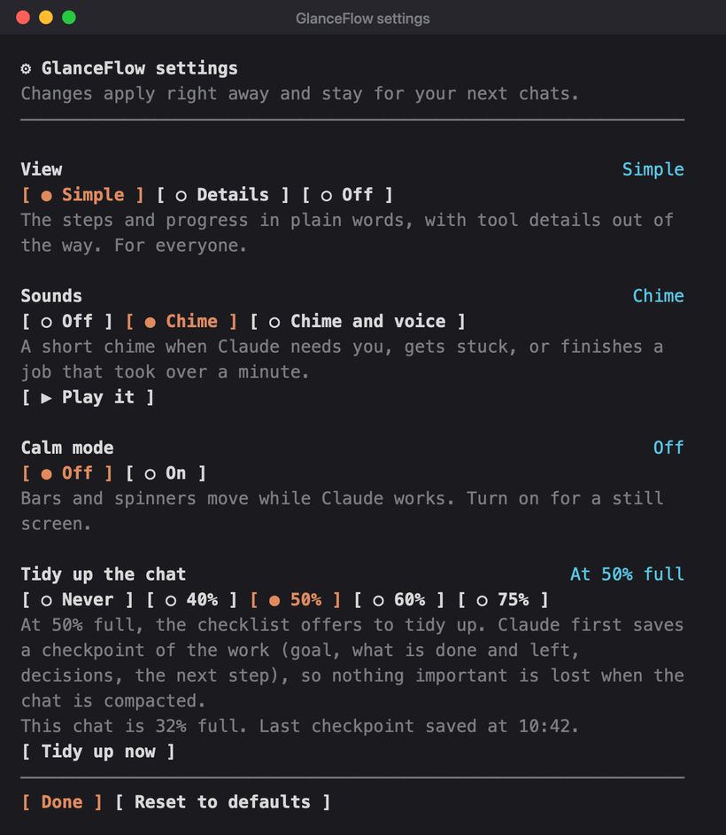
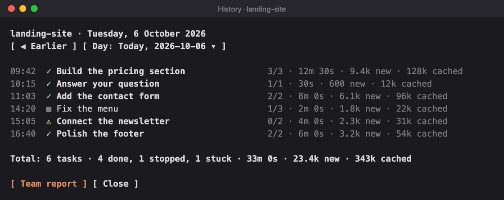
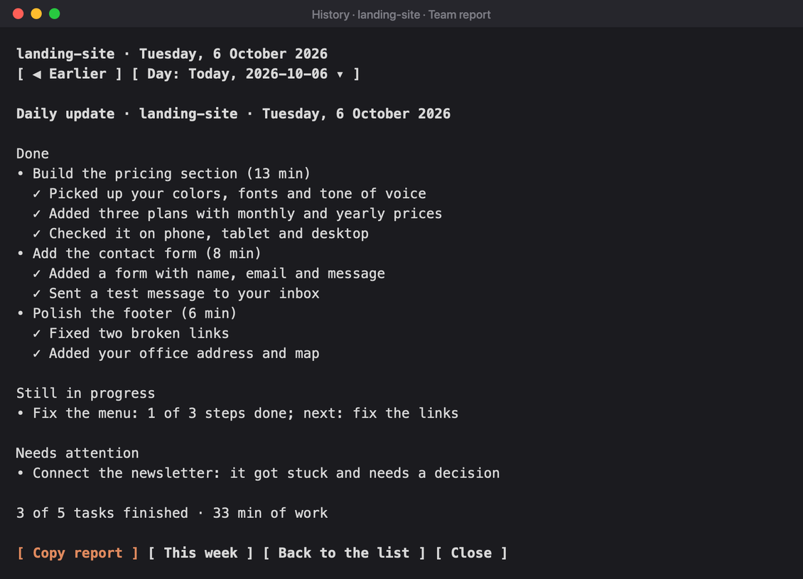

# GlanceFlow

**See what Claude is doing, at a glance.** A calm checklist above the prompt: the plan, the step Claude is on, how far along it is, and a clear signal when Claude needs you.



<sub>A scripted job: the checklist frames are drawn by GlanceFlow itself; the window around them is illustrative.</sub>

## Install

You need:

- Claude Code 2.1.288 or later, in the terminal or the Desktop app's Code tab.
- Mods turned on for your account. Run `claude plugin test` in any folder: "served off" means they aren't on yet.

Then run:

```bash
claude plugin marketplace add Antreas-Strb/glanceflow
```

```bash
claude plugin install glanceflow@claude-mods
```

Then open a new chat. The first time, three short welcome cards above the prompt show what the checklist is, what **Needs you** means and where Settings and History are. Press **Next ▶** or **Skip**; `/glanceflow tour` shows them again.

**Update:** `claude plugin marketplace update claude-mods`, then `claude plugin update glanceflow@claude-mods`, then open a new chat.

**Coming from Glance?** GlanceFlow is its new name. Uninstall the old one first (`claude plugin uninstall glance@claude-mods`), then install `glanceflow@claude-mods`. Your settings and history come along on the first chat; the command is now `/glanceflow`.

**Remove:** `claude plugin uninstall glanceflow@claude-mods`.

## For everyone, and for engineers

The button above the prompt cycles **Simple → Details → Off**. The view and on/off are remembered after a restart.

- **Simple**, for people who aren't technical: tool calls, file diffs and command output are hidden. You see only the checklist, plain-English step names and Claude's answers.
- **Details**, for software engineers: the checklist stays, **and the tool calls, diffs and command output stay in view too**. Each step also shows:
  - its bar filling gradually from a time estimate, with running time and time left, e.g. `62% 1m 52s · ~1m left`; finished steps show how long they took
  - each helper's type, model and effort, e.g. `Explore · Haiku 4.5 · low effort`
  - tokens per step, new ones first, then the cheaper ones read back from the prompt cache, e.g. `3k new · 45k cached`; Claude's final answer counts in the job's total only
  - plan usage all the time, e.g. `Plan usage: 5-hour 42% · weekly 18% · chat 34% full`
  - what each job cost, e.g. `$0.42`, where Claude Code keeps a cost (pay-as-you-go API use); the History panel shows it per job and per day
- **Off**: Claude Code as usual. Only the password guard stays on (it has its own switch in ⚙ Settings).



<sub>Details on a scripted job, with time sped up. The tool rows in the chat above the checklist are not shown here.</sub>

## What you get

- **Plan first:** before Claude uses a tool, it lays out 2 to 8 plain-English steps. A quick question needs no plan.
- **Approve the plan first (optional):** turn it on in ⚙ Settings or with `/glanceflow approve on`, and Claude shows its plan and waits. Press **▶ Start**, or tell Claude what to change and it lays out a new plan.
- **Live progress:** each step's meter fills as Claude reports progress. The header shows the overall percentage and about how long is left: from the first step once History knows how fast your steps go in this project (a few finished jobs), otherwise after two steps. A plan of more than five steps folds its finished steps, and the steps after the next one, into a line each; **▤ Plan** shows them all.
- **What Claude is doing right now:** a quiet line under the current step says it in one whole sentence: Claude's own description when it fits, like `Now: Check the page on a phone screen`, otherwise a short phrase like `Reading files (3)` or `Running the tests`. No file names or commands.
- **What each step got done:** when a step is checked off, Claude adds one plain-English line on what it did ("Added a pricing table with three plans"). It shows under the step until Claude moves on, and goes into the History and the Team report.
- **Sounds, if you want them:** `/glanceflow sound on` plays a short chime when Claude needs you, gets stuck, or finishes a job that took over a minute, so you can look away. `/glanceflow sound voice` also says it ("Claude needs you"). Off by default (turn it on in ⚙ Settings). Works on macOS, Windows and Linux; on Linux it uses the sound player the computer has (PipeWire, PulseAudio or ALSA) and, for the words, speech-dispatcher or eSpeak.
- **Desktop notices, if you want them:** `/glanceflow notify on` shows a notice from your computer when Claude needs you, gets stuck, or finishes a job that took over a minute, with the reason in it. You see it even while you work in another app. Off by default (turn it on in ⚙ Settings); macOS and Linux.
- **Calm mode:** `/glanceflow calm on` stops everything that moves (the sweeping bar, the helper spinners) and shows statuses in bold.
- **Status at a glance:** every status says what is happening and, when Claude needs you, where to answer. Claude waiting for its own helpers is never **Needs you**.
- **Helpers and background work:** subagents and background tasks show under the step that started them. GlanceFlow doesn't say All done while they still run.
- **Password guard:** a message that looks like it holds a password, API key, token, card or bank number is not sent. It goes back into the prompt box; send it again within 2 minutes to send it anyway. This guard stays on even when GlanceFlow is off; turn it off in ⚙ Settings or with `/glanceflow guard off` if it gets in your way.
- **Privacy on screen:** emails, phone numbers, keys and card numbers are masked in the conversation and in step names. Claude still reads the original text.
- **Plan limits:** a warning shows at 80% of a plan window (red at 95%), and a "Tidy it up" button appears when the chat is half full (pick the point in ⚙ Settings). Tidying up first has Claude save a checkpoint of the work (goal, what is done and left, decisions, the next step); the compaction keeps it, and Claude keeps reading it for the rest of the chat, so nothing important is forgotten.

## What each status means



## Pause and Continue

Under the checklist, **‖ Pause** stops Claude while it works, and **▶ Continue** picks the same job up again, with nothing to type. Continue also shows after Esc, when Claude got stuck, or when it is waiting with steps left. The header says **‖ Paused** after Pause and **■ Stopped** after Esc. `/glanceflow pause` and `/glanceflow continue` do the same, and so does typing "continue" (or "συνέχισε") after Esc: the same job picks up, plan and all.

## The whole plan

**▤ Plan** under the checklist (or `/glanceflow plan`) opens the whole plan in a side panel, with what the checklist has no room for: when the job started and about when it will be done, every step however long the plan, with long names shown whole, what each finished step got done and how long it took, about how long each step still to come should take, what Claude is doing now in its own words, and every helper. In Details it adds the command or file Claude is working on, tokens per step, the job's cost and plan usage. It stays live while Claude works, so the checklist above the prompt can stay short.



## Settings

**⚙ Settings** under the checklist (or `/glanceflow settings`) puts every choice in one panel. Each shows what is picked and a line on what that choice does: the view (Simple, Details or Off), sounds (with ▶ Play it to hear them), desktop notices, calm mode, whether to approve the plan first, the password guard, and when to tidy up the chat (never, or at 40, 50, 60 or 75% full), with a **Tidy up now** button. Changes apply right away and stay for your next chats.



## History for a retro

**☰ History** under the checklist (or `/glanceflow history`) opens a side panel with today's jobs in this project: when each started, how it ended (✓ done, ■ stopped, ⚠ stuck), steps done, how long it took and its tokens, with the day's totals at the bottom.



In the panel, **◀ Earlier**, the day drop-down, **Later ▶** and **Today** move between days (or type `/glanceflow history yesterday`, `/glanceflow history 2026-10-06`). The history stays on this computer and keeps 30 days.

**Team report** turns the day into a short update in plain words for the team, a manager or a CEO, and copies it to paste into Slack, Teams or an email: what got done (step by step, in Claude's words), what is still in progress and what is next, what needs a decision, and the time spent. **This week** switches it to the 7 days up to the day picked, for a weekly update or a retro. No tokens, models or file names, and quick questions are left out.



**Your week** (or `/glanceflow week`) is a short summary just for you, across every project: how many steps Claude checked off in how many tasks, the time at work, your busiest day and the biggest tasks. It covers the 7 days up to the day picked and is copied, ready to keep or share.

```
Your week with Claude · 30 Sept 2026 to 6 Oct 2026

Claude checked off 23 steps in 9 tasks, and finished 7 of them.
Time at work: 4 h 10 min, across 3 projects.
Busiest day: Tuesday, with 4 tasks.

Biggest tasks
• Build the pricing page (6 steps)
• Write the welcome email (4 steps)
• Fix the contact form (3 steps)
```

<sub>The History panel and the Team report above are drawn by GlanceFlow from a sample day.</sub>

## Fresh chat (handoff)

**↻ Fresh chat** under the checklist (or `/glanceflow handoff`), shown once the chat has some work in it, moves the work to a fresh chat: when a chat is too long, close to its limits, or whenever you want a clean start. Press it twice (the first press asks to confirm). Claude writes a short handoff note (goal, what is done, what is left, decisions, the next step), the chat is cleared, and the note is sent as the fresh chat's first message. The note is also saved: `/glanceflow handoff note` puts the last one back in the prompt box.

## Commands

| Command | What it does |
|---|---|
| `/glanceflow` | Turns GlanceFlow on or off |
| `/glanceflow on`, `/glanceflow off` | Turns it on or off |
| `/glanceflow details` | Switches between Simple and Details |
| `/glanceflow details on`, `/glanceflow details off` | Picks Details or Simple |
| `/glanceflow history` | Shows today's jobs in this project |
| `/glanceflow history yesterday`, `/glanceflow history 2026-10-06` | Shows another day |
| `/glanceflow week` | Your week across every project, in a few lines, copied to share |
| `/glanceflow tour` | Shows the three welcome cards again |
| `/glanceflow pause`, `/glanceflow continue` | Pauses Claude, or picks the job up again |
| `/glanceflow plan` | Opens the whole plan in a side panel |
| `/glanceflow settings` | Opens the settings: view, sounds, desktop notices, calm mode, plan approval, password guard and when to tidy up |
| `/glanceflow tidy` | Saves a checkpoint, then tidies up the chat |
| `/glanceflow tidy at 60`, `/glanceflow tidy off` | When the checklist offers to tidy up |
| `/glanceflow handoff` | Starts a fresh chat from a handoff note |
| `/glanceflow handoff note` | Puts the last handoff note in the prompt box |
| `/glanceflow sound on`, `/glanceflow sound voice`, `/glanceflow sound off` | A chime (and words) when Claude needs you, gets stuck or finishes a long job |
| `/glanceflow notify on`, `/glanceflow notify off` | A notice from your computer when Claude needs you, gets stuck or finishes a long job |
| `/glanceflow calm on`, `/glanceflow calm off` | Nothing moves; statuses in bold |
| `/glanceflow guard on`, `/glanceflow guard off` | Turns the password guard on or off |
| `/glanceflow approve on`, `/glanceflow approve off` | Claude waits for ▶ Start before it works, or starts right away |

The button above the prompt cycles Simple, Details and Off.

## Limits

- The Desktop app draws its own one-line tool summary ("Used 3 tools"); a mod can't hide it.
- Pattern matching can't catch every secret written in plain words.
- Background tasks are checked at the end of each of Claude's replies.
- Each new job gets a short English name from Haiku in the background: one small model request per job.

## Credits

The secret and personal-detail patterns in `glanceflow/hooks/privacy.ts` are adapted from [Nate Herk's Recording Mode](https://github.com/nateherkai/claude-code-mods) (MIT licence). The overall progress and time-left idea comes from his Goal Meter.

## License

MIT. See [LICENSE](LICENSE). Third-party code is listed in [THIRD-PARTY-NOTICES.md](THIRD-PARTY-NOTICES.md).
